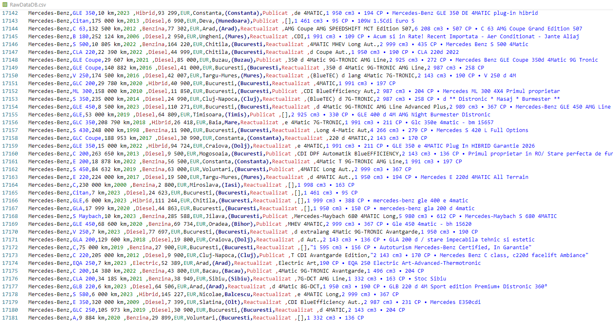

# EvaCar

## Price Evaluation & Prediction on Romanian second-hand Car market

### Description
EvaCar is a repository that contains code and documentation for Romanian second-hand market:
- evaluation of the current state of the market.
- prediction of the car price based on car model, year of production, fuel, mileage, etc.

#### General notes

The dataset used in this study is obtained from one of the most important car seller platform in Romania.\
The dataset was obtained from one single source.\
The dataset contains data available on 10th December 2023 on Car Seller Platform.

### Statements

1. #### Business understanding
Business questions:
1. How many cars are used in the analyze?
2. Which is the most expensive / cheapest car?
3. Which manufacturer / model has more / less cars?
4. Which manufacturer / model is most expensive / cheapest at average?
5. In which county / city are selling most cars?
6. Which type of fuel is most / fewest selling?
7. Which is the biggest / smallest engine capacity?
8. Which is the biggest / smallest milleage?
9. How many cars are manufactured in current year?

2. #### Analytic approach

3. #### Data requirements

### Data processing

1. #### Data collection
Data collection was performed with internal tool --> data_scrapper.\
Data were retrieved on 10th December 2023 from Romanian Car selling platform.
#### Stages
1. Identify online resources that sell cars in Romania.
2. Create a list with all available cars.
3. Analyze source HTML structure, identify necessary HTML elements and HTML classes.
4. Create schema with desired columns that will be retrieved from source.
5. Create web scrapper using Beautiful Soup library and Pandas for save to CSV file.
6. Build scenario to retrieve necessary data.
7. Apply data_scrapper scenario.

2. #### Data understanding
3. #### Data preparation

### Model build

1. #### Modeling
2. #### Evaluation

### Model deployment

1. #### Deployment

### Continuous improvement

1. #### Feedback
