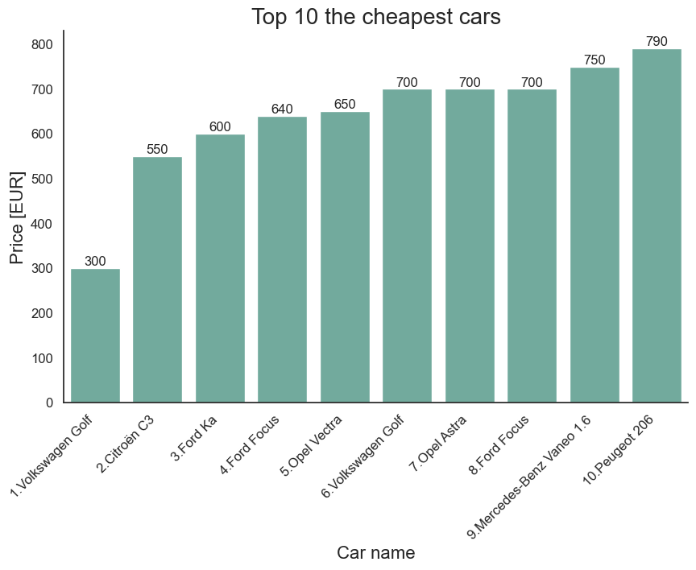
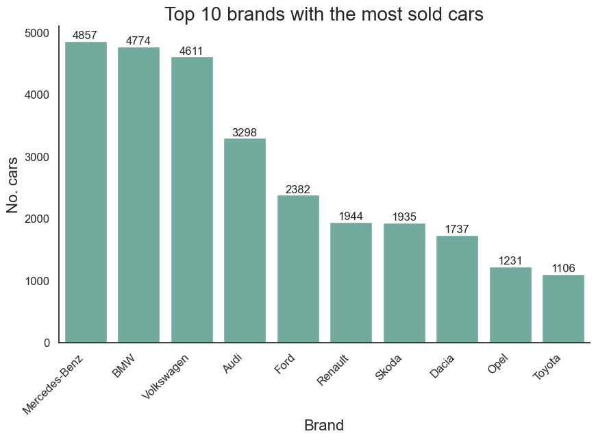
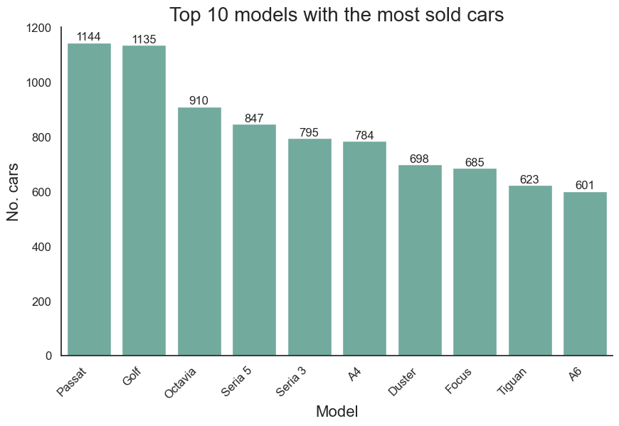

# EvaCar

## Evaluation & Prediction on the second-hand Car market in Romanian

## Description

### General notes
EvaCar is a repository that contains data, code, and documentation for Romanian second-hand car's market:
- evaluation of the current state of the market.
- prediction of the car price based on car model, year of production, fuel, mileage, etc.

### Statements
The dataset used in this study was obtained:
- from one single source.
- using web scraping process.
- from one of the most important car seller platform in Romania.
- data available on 10th December 2023 on Car Seller Platform.

### 1. Business understanding
*Activity to seek clarification. Having this understanding is placed at the beginning of the methodology because getting clarity around the problem to be solved, allows to determine which data will be used to answer the core question. Establishing a clearly defined question starts with understanding the goal of the person who is asking the question.*

### 2. Analytic approach
*Selecting the right analytic approach depends on the question being asked. The appropriate analytic approach for the problem is selected in the context of the business requirements. This means identifying what type of patterns will be needed to address the question most effectively. If the question is to determine probabilities of an action, then a predictive model might be used. If the question is to show relationships, a descriptive approach maybe be required. This would be one that would look at clusters of similar activities based on events and preferences. Statistical analysis applies to problems that require counts. For example if the question requires a yes/ no answer, then a classification approach to predicting a response would be suitable.*

### 3. Data requirements
*Which data are required, how to source or to collect them, how to understand or work with them, and how to prepare the data to meet the desired outcome.*

### 4. Data collection
*After the initial data collection is performed, an assessment takes place to determine whether or not have what is needed. In this phase the data requirements are revised and decisions are made as to whether or not the collection requires more or less data. Once the data data are collected, then in the data collection stage it will have a good understanding of what it will be working with. Techniques such as descriptive statistics and visualization can be applied to the data set, to assess the content, quality, and initial insights about the data. Gaps in data will be identified and plans to either fill or make substitutions will have to be made.*

### 5. Data understanding
*Data understanding encompasses all activities related to constructing the data set. Essentially, the data understanding section answers the question: Is the data that you collected representative of the problem to be solved? In order to understand the data, descriptive statistics needed to be run against the data columns that would become variables in the model. First, these statistics included hurst, univariates, and statistics on each variable, such as mean, median, minimum, maximum, and standard deviation. Second, pairwise correlations were used, to see how closely certain variables were related, and which ones, if any, were very highly correlated, meaning that they would be essentially redundant, thus making only one relevant for modeling. Third, histograms of the variables were examined to understand their distributions. Histograms are a good way to understand how values or a variable are distributed, and which sorts of data preparation may be needed to make the variable more useful in a model. For a categorical variable that has too many distinct values to be informative in a model, the histogram would help them decide how to consolidate those values. The univariates, statistics, and histograms are also used to assess data quality. From the information provided, certain values can be re-coded or perhaps even dropped if necessary, such as when a certain variable has missing values.*

### 6. Data preparation
*Transforming data in the data preparation phase is the process of getting the data into a state where it may be easier to work with. Specifically, the data preparation stage of the methodology answers the question: What are the ways in which data is prepared? To work effectively with the data, it must be prepared in a way that addresses missing or invalid values and removes duplicates, toward ensuring that everything is properly formatted. Feature engineering is also part of data preparation. It is the process of using domain knowledge of the data to create features that make the machine learning algorithms work.*

### 7. Modeling
*Data Modelling focuses on developing models that are either descriptive or predictive. An example of a descriptive model might examine things like: if a person did this, then they're likely to prefer that. A predictive model tries to yield yes/no, or stop/go type outcomes. These models are based on the analytic approach that was taken, either statistically driven or machine learning driven. It will use a training set for predictive modelling. The training set acts like a gauge to determine if the model needs to be calibrated. In this stage, it will play around with different algorithms to ensure that the variables in play are actually required.*

### 8. Evaluation
*Evaluation allows the quality of the model to be assessed but it's also an opportunity to see if it meets the initial request. Evaluation answers the question: Does the model used really answer the initial question or does it need to be adjusted? Model evaluation can have two main phases. The first is the diagnostic measures phase, which is used to ensure the model is working as intended. If the model is a predictive model, a decision tree can be used to evaluate if the answer the model can output, is aligned to the initial design. It can be used to see where there are areas that require adjustments. If the model is a descriptive model, one in which relationships are being assessed, then a testing set with known outcomes can be applied, and the model can be refined as needed. The second phase of evaluation that may be used is statistical significance testing. This type of evaluation can be applied to the model to ensure that the data is being properly handled and interpreted within the model.*

### 9. Deployment
*While a data science model will provide an answer, the key to making the answer relevant and useful to address the initial question, involves getting the stakeholders familiar with the tool produced. In a business scenario, stakeholders have different specialties that will help make this happen, such as the solution owner, marketing, application developers, and IT administration. Once the model is evaluated and the data scientist is confident it will work, it is deployed and put to the ultimate test. Depending on the purpose of the model, it may be rolled out to a limited group of users or in a test environment, to build up confidence in applying the outcome for use across the board.*

### 10. Feedback
*Once in play, feedback from the users will help to refine the model and assess it for performance and impact. The value of the model will be dependent on successfully incorporating feedback and making adjustments for as long as the solution is required. Then the model would be refined, based on all of the data compiled after model implementation and the knowledge gained throughout these stages. But after feedback and practical experience with the model, it might be determined that adding that data could be worth the investment of effort and time. We also have to allow for the possibility that other refinements might present themselves during the feedback stage. Also, the intervention actions and processes would be reviewed and very likely refined as well, based on the experience and knowledge gained through initial deployment and feedback. Finally, the refined model and intervention actions would be redeployed, with the feedback process continued throughout the life of the Intervention program.*

## Implementation

### 1. Business understanding
The main goal of this study is to highlights trends in Romanian second-hand car's market. First specific goal is to provide an analytical, quantitative and qualitative study on existing data for an overview on the big picture for better understanding of the current situation in market without any other analysis. Second specific goal is to provide a tool that predict future trends on the market and the price of the car based on specific characteristics. Third specific goal is to provide a web platform for visualization and prediction for end users. To achieve those specific goals, a list of business questions will be treated in this study.\

#### Business questions:
1. How many cars are used in the analyze?
2. Which is the most expensive / cheapest car?
3. Which manufacturer / model has more / less cars?
4. Which manufacturer / model is most expensive / cheapest at average?
5. In which county / city are selling most cars?
6. Which type of fuel is most / fewest selling?
7. Which is the biggest / smallest engine capacity?
8. Which is the biggest / smallest milleage?
9. How many cars are manufactured in current year?
10. Which manufacturer / model is most / least devalued?
11. Which is the predicted price of the care based on specific characteristics?

All questions will be answered in code, implemented in web application, and highlighted in the Final Report.

### 2. Analytic approach
It will be used the Statistical analysis to answer business questions 1-10. It will be used Python programming language, Numpy, Pandas, and Matplotlib for data analyze and vizualization.\
It will be used Regression algorithms to answer business question 11. It will be used Python programming language, SciPy, scikit-learn libraries.\
It will be used Python, Plotly, and Dash for web application.

### 3. Data requirements
#### Dataset columns
For current study dataset should contains follow columns:
- manufacturer - string - car brand.
- model - string - car's models on specific brand.
- mileage - integer - how many km has the car traveled in km.
- capacity -integer - the cylinder capacity of the engine in cm3.
- power - integer - the power of the engine in horsepower.
- year - integer - the year in which the car was produced.
- fuel - string - the type of fuel of the car.
- price - integer - the selling price of the car.
- currency - string - the currency in which the car is sold.
- city - string - the city where the car is sold.
- county - string - the county where the car is sold.
- status - string - the publication status of the car sale ad.
- short description - string - generic description of the car.
- long description - string - long description of the car.

#### Web scraping
Data was obtained using web scraping process using internal tool ***data_scraper.py*** implemented in main program ***main.py*** and saved in CSV format as ***RawDataDB-YY-MM-DD.csv*** file follow next stages:
- Identify online resources that sell cars in Romania.
- Create a list with all available cars.
- Analyze source HTML structure, identify necessary HTML elements and HTML classes.
- Create schema with desired columns that will be retrieved from source.
- Create web scraper using Beautiful Soup library and Pandas for save to CSV file.
- Build scenario to retrieve necessary data.
- Apply data_scraper scenarios.

#### Result of the stage

#### Raw data history
|No|Name|Date|Counts [rows]|Size [kB]|
|:---:|:---:|:---:|:---:|:---:|
|1|RawDataDB-23-12-10.csv|10.12.2023|36534|5554|
|2|-|10.01.2024|-|-|
|3|-|10.02.2024|-|-|
|4|-|10.03.2024|-|-|
|5|-|10.04.2024|-|-|
|6|-|10.05.2024|-|-|
|7|-|10.06.2024|-|-|
|8|-|10.07.2024|-|-|
|9|-|10.08.2024|-|-|
|10|-|10.09.2024|-|-|
|11|-|10.10.2024|-|-|
|12|-|10.11.2024|-|-|
|13|-|10.12.2024|-|-|
|-|-|-|-|-|

### 4. Data collection
#### Initial result of the stage

#### Statements
There are missing 2 necessary columns, capacity and power. Those two columns will be obtained from long_description column in the next stage.\
The data type of the columns mileage, price, capacity, and power will be converted to integer type.\
After retrieving capacity and power columns, short_description and long_description will be deleted from working dataset.\
Missing values will be replaced with value zero and will be neglected in count operations.

#### Final result of the stage

#### Data processing
Data was processed using Python notebook ***data_analyzer.ipynb*** and saved in CSV format as ***ProcessedDataDB-YY-MM-DD.csv*** file.

#### Processed data history
|No|Name|Date|Counts [rows]|Size [kB]|
|:---:|:---:|:---:|:---:|:---:|
|1|ProcessedDataDB-23-12-10.csv|10.12.2023|36534|3090|
|2|-|10.01.2024|-|-|
|3|-|10.02.2024|-|-|
|4|-|10.03.2024|-|-|
|5|-|10.04.2024|-|-|
|6|-|10.05.2024|-|-|
|7|-|10.06.2024|-|-|
|8|-|10.07.2024|-|-|
|9|-|10.08.2024|-|-|
|10|-|10.09.2024|-|-|
|11|-|10.10.2024|-|-|
|12|-|10.11.2024|-|-|
|13|-|10.12.2024|-|-|
|-|-|-|-|-|

### 5. Data understanding
#### Exploratory Data Analysis
In Exploratory Data Analysis stage will be answered business questions 1-10.
1. How many cars are used in the analyze?
- Number of cars used in current analyze is equal to 36534 cars.
2. Which is the most expensive / cheapest car?
- The most expensive car in current analyze is Ferrari Purosangue that costs 918680 EUR.

- The cheapest car in current analyze is Volkswagen Golf that costs 300 EUR.

3. Which manufacturer / model has more / less cars?
- Manufacturer with the most cars is Mercedes-Benz with 4857 cars.

- The most cars are of model Passat with 1144 cars.

- Manufacturer with most cars is Ineos with 1 cars.

- Model with fewest cars is M2 M235i with 1 cars.

4. Which manufacturer / model is most expensive / cheapest at average?
- The most expensive manufacturer at average is Rolls-Royce with average price of 364534.1 EUR/car.
- The most expensive model at average is Purosangue with average price of 918680.0 EUR/car.
- The cheapest manufacturer at average is Daewoo with average price of 1229.6 EUR/car.
- The cheapest model at average is Vaneo 1.6 with average price of 750.0 EUR/car.
5. In which county / city are selling most cars?
- The most cars are in Bucuresti county with 12848 cars.
- The most cars are in Bucuresti city with 8696 cars.
6. Which type of fuel is most / fewest selling?
- The most cars with total number of 22736 cars are used Diesel fuel.
- The fewest cars with total number of 18 cars are used Benzina + CNG fuel.
7. Which is the biggest / smallest engine capacity?
- The max capacity of 8200 HP has Cadillac Eldorado.
- The max capacity of 0 HP has Aixam City.
8. Which is the biggest / smallest milleage?
- The max mileage of 2800000 KM has BMW X5 xDrive30d.
- The min mileage of 0 KM has Aixam Crossover.
9. How many cars are manufactured in previous and current year?
- Number of cars that were manufactured in 2023 is 2782.
10. Which manufacturer / model is most / least devalued?
- TBA.